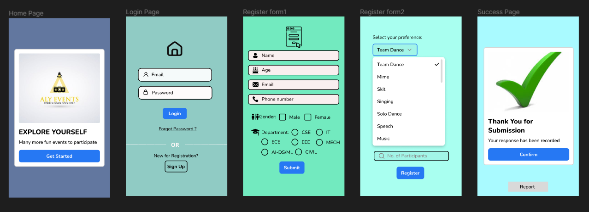

# Event Registration Web Application

## AIM:
To design, develop and deploy a web application for event registration.

## DESIGN STEPS:

### Step 1:
Go to the figma.com website.

### Step 2:
Start making the UI design for event registration.

### Step 3:
Create 5 pages of Home page, Login page, Register Page and Thank you Page.

### Step 4:
Protoype the code and export.

### Step 5:
Validate the HTML and CSS code.

### Step 6:
Publish the website in the given URL.

## DESIGN:
Figma

## OUTPUT:

## Result:
Hence the UX design for the Event Registration webpage is done.

